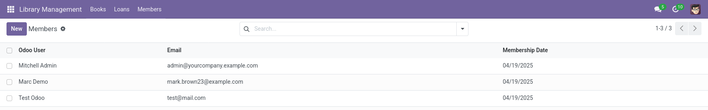
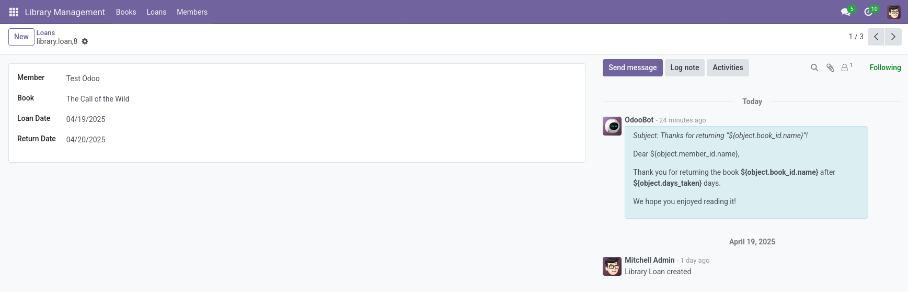
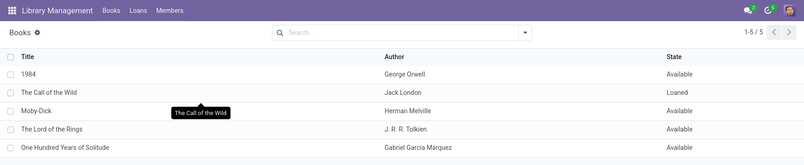

# Library Management Module for Odoo 17

A simple library management system built as an Odoo module. Manage members, books, and loans efficiently.


## Features

- **Member Management**:

  - Link members to Odoo users.
  - Track membership dates.
  - Automatic email/phone sync from user profiles.

- **Book Management**:

  - Add books with titles, authors, and ISBNs.
  - Track availability status.

- **Loan System**:

  - Record book loans to members.
  - Auto-calculate return dates.
  - Restrict users to view only their own loans (configurable security rules).

- **User-Friendly Views**:
  - Chatter and activities integration.
  - List/Form views for members, books, and loans.

## Installation

1. **Clone the module**:
   ```bash
   git clone https://github.com/emrekndl/odoo-apps.git
   ```

Place the `/odoo-apps/library_management` folder in your Odoo addons directory.

2. **Install Dependencies**:

   - Requires Odoo 17.0 or later.

3. **Enable the Module**:
   - Go to Odoo Apps → Search "Library Management" → Install.

## Configuration

1. **Members**:

   - Navigate to _Library → Members_ to add library members.
   - Link members to existing Odoo users via the `Odoo User` field.

2. **Books**:

   - Add books under _Library → Books_.

3. **Loans**:
   - Create loans from _Library → Loans_.
   - Users in the `library_user` group will only see their own loans.

## Screenshots

| Members List                     | Loan Form                      | Book List                      |
| -------------------------------- | ------------------------------ | ------------------------------ |
|  |  |  |

## Security Rules

- **Library User Group**:
  - Users can only view their own loan records.
  - Admins have full access.

## License

This project is licensed under the [MIT License](LICENSE).

---
