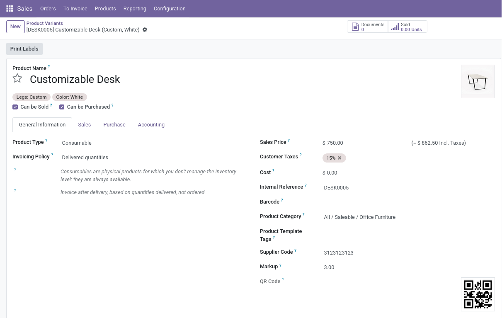

# A Simple Product Inherited Module for Odoo 17

A simple sales module poruduct variants inherited project.


## Features

- **Product Variants New Fields**:

  - supplier_code field.
  - qr_code computed field.
  - markup field(only in product template)

## Installation

1. **Clone the module**:
   ```bash
   git clone https://github.com/emrekndl/odoo-apps.git
   ```

Place the `/odoo-apps/product_custom_attrs` folder in your Odoo addons directory.

2. **Install Dependencies**:

   - Requires Odoo 17.0 or later.

3. **Enable the Module**:
   - Go to Odoo Apps → Search "product_custom_attrs " → Install.

## Screenshots

| Create Product Variants         | Product Variants List         |
| ------------------------------- | ----------------------------- |
|  |  |

**InheritProductProduct**:

```python
# -*- coding: utf-8 -*-

import re

from odoo import _, api, fields, models
from odoo.exceptions import ValidationError

from ..utils.qr_code_utils import create_qr_code


class InheritProductProduct(models.Model):
    """Product Variants Fields"""

    _inherit = "product.product"

    supplier_code = fields.Char(string="Supplier Code", size=11)
    qrcode = fields.Binary(string="QR Code", compute="_compute_qrcode", store=True)

    # TODO: A function control size of "suplier_code" can be added.
    @api.constrains("supplier_code")
    def _check_supplier_code(self):
        for rec in self:
            if code := rec.supplier_code:
                if not re.fullmatch(r"\d+", code):
                    raise ValidationError(
                        _("Invalid Supplier Code: Only numbers 0-9 can be entered.")
                    )

    @api.onchange("supplier_code")
    def _onchange_supplier_code(self):
        if self.supplier_code and not self.supplier_code.isdigit():
            return {
                "warning": {
                    "title": _("Warning"),
                    "message": _(
                        "Invalid Supplier Code: Only numbers 0-9 can be entered."
                    ),
                    "type": "notification",
                }
            }

    @api.depends("supplier_code")
    def _compute_qrcode(self):
        for rec in self:
            if sp_code := rec.supplier_code:
                rec.qrcode = create_qr_code(sp_code)
```

---

## License

This project is licensed under the [MIT License](LICENSE).
